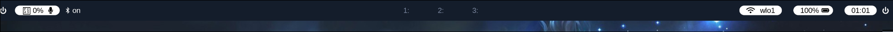
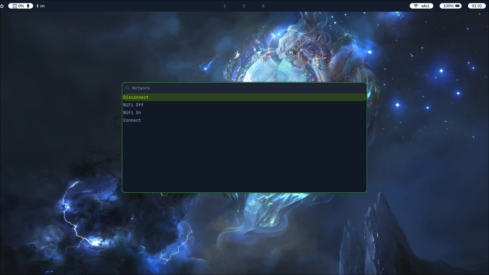

# hyprland-dotfiles
*Athena-OS  X  Hyprland config file*

Custom Hyprland dotfiles for Athena OS — a sleek, minimal Wayland workflow tuned for penetration testing, productivity, and cloud CTF environments like Parrot CTF.
___
click [**Athena-OS**](./AthenaOS/athena.md) to learn more.

___

___*Desktop*___

___

___Terminal : Kitty___
 

ignore the waybar 🙄

___

___waybar___
 

___

___Network-Menu : Wofi-nmcli___
 

___

___*Wallpaper* : [wallhaven.cc](https://wallhaven.cc/w/x1e13l)___

